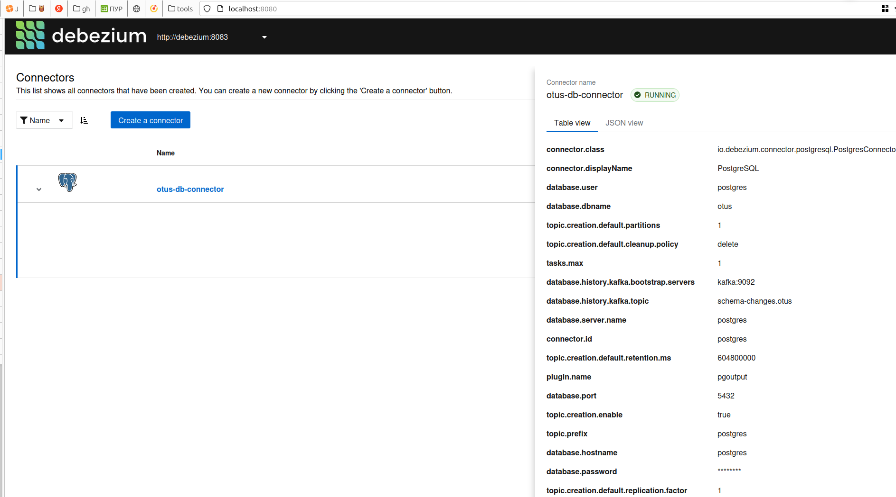
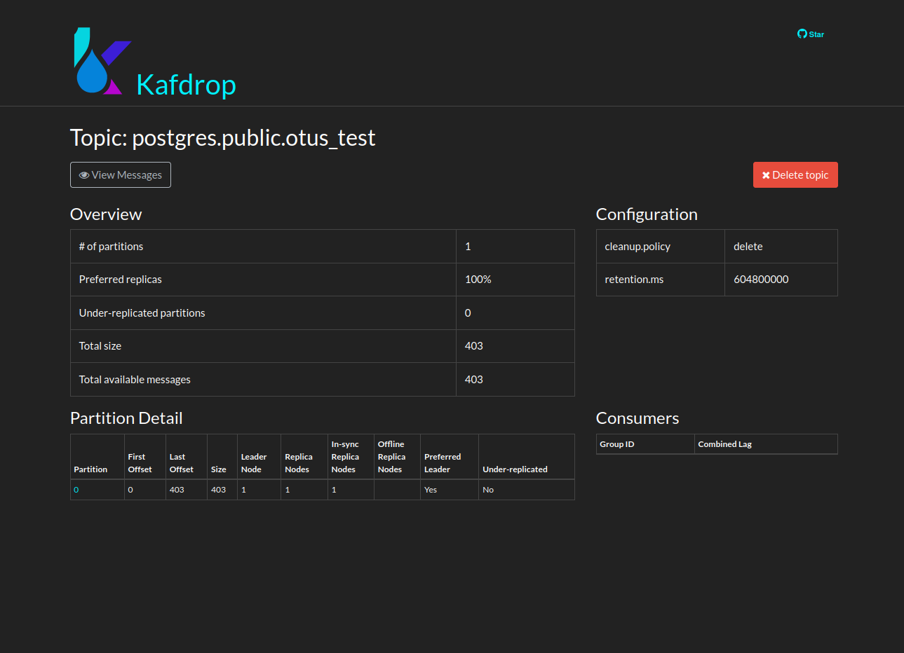

# Kafka Connect

## Научиться разворачивать Kafka Connect и настраивать интеграцию с postgresSQL

## Описание/Пошаговая инструкция выполнения домашнего задания:

Развернуть Kafka Connect, настроить интеграцию с postgreSQL используя Debezium PostgreSQL CDC Source Connector:

- Запустить Kafka
- Запустить PostgreSQL
- Создать в PostgreSQL тестовую таблицу
- Настроить Debezium PostgreSQL CDC Source Connector
- Запустить Kafka Connect
- Добаить записи в таблицу
- Проверить, что записи появились в Kafka

---

### Решение

1. Поднимаем [инфраструктуру](./docker-compose.yml)
    ```shell
    docker-compose up -d
    ```
2. Загружаем [коннектор](./connector.json)

```sh
 curl -X POST --location "http://localhost:8083/connectors" -H "Content-Type: application/json" -H "Accept: application/json" -d @connector.json
```

3. Проверяем что коннектор загрузился через [debezium-ui](http://localhost:8080/)

4. Подключаемя и создаем записи в таблице otus_test
  ```sql
  delete  from otus_test
  with data as  (
  select generate_series(1 , 100) val)
  insert into   otus_test (id, homework, num)
  select  val , format('homework number %s' , val), val from data;

  ```

5. Проверем через [kafdrop топик](localhost:9000/topic/postgres.public.otus_test/)
   
   



<details>
<summary>произвольное сообщение в топике</summary>

```json
{
   "schema": {
      "type": "struct",
      "fields": [
         {
            "type": "struct",
            "fields": [
               {
                  "type": "int64",
                  "optional": false,
                  "field": "id"
               },
               {
                  "type": "string",
                  "optional": false,
                  "field": "homework"
               },
               {
                  "type": "int32",
                  "optional": false,
                  "field": "num"
               }
            ],
            "optional": true,
            "name": "postgres.public.otus_test.Value",
            "field": "before"
         },
         {
            "type": "struct",
            "fields": [
               {
                  "type": "int64",
                  "optional": false,
                  "field": "id"
               },
               {
                  "type": "string",
                  "optional": false,
                  "field": "homework"
               },
               {
                  "type": "int32",
                  "optional": false,
                  "field": "num"
               }
            ],
            "optional": true,
            "name": "postgres.public.otus_test.Value",
            "field": "after"
         },
         {
            "type": "struct",
            "fields": [
               {
                  "type": "string",
                  "optional": false,
                  "field": "version"
               },
               {
                  "type": "string",
                  "optional": false,
                  "field": "connector"
               },
               {
                  "type": "string",
                  "optional": false,
                  "field": "name"
               },
               {
                  "type": "int64",
                  "optional": false,
                  "field": "ts_ms"
               },
               {
                  "type": "string",
                  "optional": true,
                  "name": "io.debezium.data.Enum",
                  "version": 1,
                  "parameters": {
                     "allowed": "true,last,false,incremental"
                  },
                  "default": "false",
                  "field": "snapshot"
               },
               {
                  "type": "string",
                  "optional": false,
                  "field": "db"
               },
               {
                  "type": "string",
                  "optional": true,
                  "field": "sequence"
               },
               {
                  "type": "string",
                  "optional": false,
                  "field": "schema"
               },
               {
                  "type": "string",
                  "optional": false,
                  "field": "table"
               },
               {
                  "type": "int64",
                  "optional": true,
                  "field": "txId"
               },
               {
                  "type": "int64",
                  "optional": true,
                  "field": "lsn"
               },
               {
                  "type": "int64",
                  "optional": true,
                  "field": "xmin"
               }
            ],
            "optional": false,
            "name": "io.debezium.connector.postgresql.Source",
            "field": "source"
         },
         {
            "type": "string",
            "optional": false,
            "field": "op"
         },
         {
            "type": "int64",
            "optional": true,
            "field": "ts_ms"
         },
         {
            "type": "struct",
            "fields": [
               {
                  "type": "string",
                  "optional": false,
                  "field": "id"
               },
               {
                  "type": "int64",
                  "optional": false,
                  "field": "total_order"
               },
               {
                  "type": "int64",
                  "optional": false,
                  "field": "data_collection_order"
               }
            ],
            "optional": true,
            "name": "event.block",
            "version": 1,
            "field": "transaction"
         }
      ],
      "optional": false,
      "name": "postgres.public.otus_test.Envelope",
      "version": 1
   },
   "payload": {
      "before": null,
      "after": {
         "id": 3,
         "homework": "data 3",
         "num": 3
      },
      "source": {
         "version": "2.2.0.Alpha3",
         "connector": "postgresql",
         "name": "postgres",
         "ts_ms": 1688456634669,
         "snapshot": "false",
         "db": "otus",
         "sequence": "[\"26648904\",\"26649248\"]",
         "schema": "public",
         "table": "otus_test",
         "txId": 745,
         "lsn": 26649248,
         "xmin": null
      },
      "op": "c",
      "ts_ms": 1688456634811,
      "transaction": null
   }
}
```
</details>

6. Задача выполнена - сообщения в топике появились

